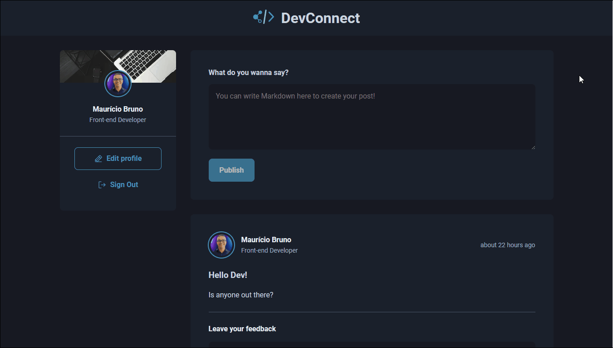

> This project is intended to be a template for social media apps using Next.js. Use it to learn or to fit your own needs.

## Technologies used

- Typescript
- React
- Next.js
- Prisma
- NextAuth
- SWR & Axios
- RadixUI

---

## Live Demo

You can see a live version of this app [here](https://devconnect.mbrunos.dev/)



## Running the project

Clone the repository:

```
git clone https://github.com/MBrunoS/devconnect.git
```

Install the dependencies:

```
yarn install
```

Then, update `prisma/schema.prisma` to use the provider you choose, and delete the `migrations` folder. Or if you want to use SQLite, you just have to create `dev.db` file.

Rename the `.env` file to `.env.local` and update the keys:

- `GITHUB_ID` and `GITHUB_SECRET`: your Github OAuth app credentials.
- `NEXTAUTH_SECRET`: a random string, you can run `openssl rand -base64 32`

Now, run the migrations on the DB:

```
yarn prisma migrate dev
```

and run the development server:

```
yarn dev
```

Happy hacking and connecting!

## Next steps

- Use opmistic UI when creating posts, comments and updating applauses
- Paginate posts and comments
- When submitting a comment, refetch only that post comments
